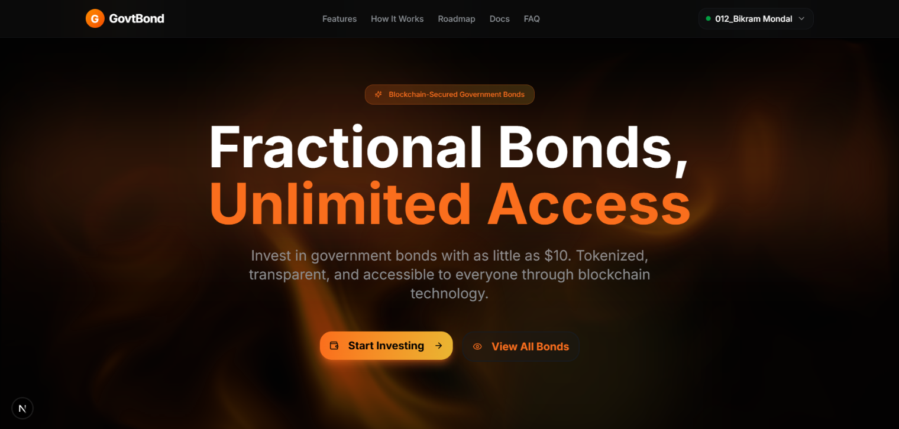

# 🏛️💎 GovtBond – Fractional Tokenized Government Bonds



GovtBond is a decentralized finance (DeFi) platform that democratizes access to government bonds. It enables retail users to invest in fractional units of government bonds using stablecoins, providing a transparent, secure, and highly accessible investment experience through blockchain technology.

## 🌟 Features

- 🧱 **Fractional Ownership** – Invest in government bonds with small amounts (GBOND tokens)
- 💵 **Stablecoin Settlement** – Frictionless global participation using USDT
- 📈 **Yield Visualization** – Real-time tracking of accrued interest and ROI
- 🔒 **Verification & Trust** – Asset proofs stored on IPFS and verified on-chain
- 🏦 **Sponsor Vault** – Sponsors provide liquidity and earn a share of fees
- 🤖 **Automated Yield** – Smart contracts automatically account for interest accrual
- 🌍 **Global Access** – Open to anyone with a Web3 wallet

## 🛠️ Technologies Used

- **Next.js** – React Framework for Frontend
- **TailwindCSS** – Advanced Styling & Responsive UI
- **Solidity** – Smart Contracts (v0.8.20)
- **Hardhat** – Development & Testing Framework
- **OpenZeppelin** – Secure Contract Standards
- **Wagmi / Viem** – Web3 Blockchain Interaction
- **MongoDB / Mongoose** – Data Management
- **NextAuth.js** – Authentication
- **IPFS** – Decentralized Storage for Asset Proofs

## ⚙️ Installation

1. Clone the repository:
```bash
git clone https://github.com/BikramMondal5/Nano-Bond.git
```

2. Navigate to the project directory:
```bash
cd Nano-Bond
```

3. Install dependencies:
```bash
npm install
# or
npm install --legacy-peer-deps
```

4. Set up environment variables:
   - Create a `.env.local` file in the root directory and add the necessary environment variables (e.g., MongoDB URI, NextAuth secret, Blockchain provider URLs).
   - Create a `.env` file in the `packages/backend` directory and add the necessary environment variables.
     - - Create a `.env` file in the `packages/contracts` directory and add the necessary environment variables.

5. Run the development server:
```bash
npm run dev
```

6. Open your browser and navigate to `http://localhost:3000` to view the app.

## 🚀 How to Use

- 🔌 **Connect Wallet** – Log in using MetaMask or any Web3 wallet.
- 💰 **Invest** – Deposit USDT to mint GBOND tokens representing fractional bond ownership.
- 📊 **Monitor Portfolio** – View your GBOND balance, accrued yield, and ROI on the dashboard.
- 🔍 **Verify Assets** – Check the "Verification" section to see IPFS data proving real-world bond backing.
- 🏦 **Sponsor (Optional)** – Deposit into the Sponsor Vault to earn fee rewards.
- 💸 **Redeem** – Upon maturity, redeem your GBOND tokens for principal plus interest.

## 🤝 Contribution

**Got ideas? or Found a bug? 🐞**
- Open an issue or submit a pull request — contributions are always welcome!

## 📜 License

This project is licensed under the `MIT License`.
